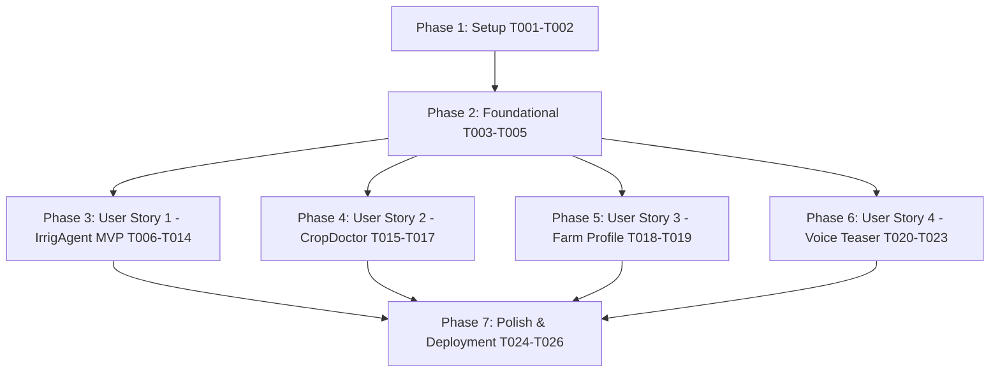

# Tasks: Hassan Persona - Proactive Irrigation Agent & Leaf Photo Triage (Darija Voice Teaser Extension)

**Input**: Design documents from `specs/001-hassan-irrigation-agent/` ([spec.md](spec.md), [plan.md](plan.md), [research.md](research.md), [data-model.md](data-model.md), [quickstart.md](quickstart.md), [contracts/](contracts/))

**Prerequisites**: plan.md (required), spec.md (required for user stories), research.md, data-model.md, contracts/

**Tests**: Unit and integration test tasks are included per FR-020, FR-021, FR-022, FR-023, SC-007, and SC-008.

**Organization**: Tasks are grouped by phase and user story to enable independent implementation and testing of each story.

## Format: `[ID] [P?] [Story] Description`

- **[P]**: Can run in parallel (different files, no blocking dependencies)
- **[Story]**: Which user story this task belongs to (`[US1]`, `[US2]`, `[US3]`, `[US4]`)
- File paths are included in task descriptions

---

## Phase 1: Setup (Shared Infrastructure)

**Purpose**: Project initialization, environment setup, and dependency verification.

- [x] T001 Verify dependency definitions in `requirements.txt` (FastAPI, uvicorn, google-cloud-firestore, google-cloud-texttospeech, google-genai, httpx, pydantic)
- [x] T002 [P] Verify environment configuration loading and feature flag validation (`ENABLE_DARIJA_VOICE_TEASER`) in `app/config.py`

---

## Phase 2: Foundational (Blocking Prerequisites)

**Purpose**: Core DB client, messaging abstractions, and webhook base routing required before user story features.

**⚠️ CRITICAL**: No user story work can begin until this phase is complete.

- [x] T003 [P] Implement Firestore helper methods for profile persistence and recommendation queries (`get_latest_recommendation_for_user`) in `app/firestore_client.py`
- [x] T004 [P] Implement Meta WhatsApp Cloud API helper functions (`send_message`, `send_audio_message`, `upload_media`) in `app/whatsapp.py`
- [x] T005 Setup FastAPI application instance, webhook verification endpoint (`GET /webhook`), and error handling in `app/main.py`

**Checkpoint**: Foundation ready - user story implementation can now begin.

---

## Phase 3: User Story 1 - Daily Proactive Irrigation Advisory & One-Tap WhatsApp Reply (Priority: P1) 🎯 MVP

**Goal**: Daily proactive evening advisory (19:00 GMT+1) based on Open-Meteo weather/ET₀ calculations with one-tap WhatsApp replies (`1`, `2`, `3`).

**Independent Test**: Trigger 18:45 advisory batch job (`POST /api/v1/jobs/daily-advisory`), receive WhatsApp advisory message, reply `1`, `2`, or `3`, verify Firestore recommendation record status update across stateless Cloud Run requests.

### Tests for User Story 1

- [x] T007 [P] [US1] Unit test Open-Meteo retries and ET₀ baseline fallback notice in `tests/unit/test_weather.py`
- [x] T009 [P] [US1] Unit test deterministic decision logic and rainfall >=15mm skip recommendation threshold in `tests/unit/test_decision.py`
- [x] T011 [P] [US1] Unit test narrow regex duration/clock time extraction for Option 3 ("Modify") replies in `tests/unit/test_regex_parser.py`
- [x] T014 [P] [US1] Integration test for inbound webhook reply handler (`1`, `2`, `3`) in `tests/integration/test_webhook.py`

### Implementation for User Story 1

- [x] T006 [P] [US1] Implement Open-Meteo weather API client with short backoff retries and ET0 baseline fallback in `app/weather.py`
- [x] T008 [P] [US1] Implement deterministic rule-based irrigation decision logic (ET0 math, rainfall >=15mm skip recommendation) in `app/decision.py`
- [x] T010 [P] [US1] Implement narrow rule-based regex parser for Option 3 ("Modify") replies in `app/regex_parser.py`
- [x] T012 [US1] Implement daily advisory batch trigger endpoint (`POST /api/v1/jobs/daily-advisory`) in `app/main.py`
- [x] T013 [US1] Implement inbound text webhook handler for reply options `1`, `2`, and `3` in `app/main.py`

**Checkpoint**: User Story 1 (Core IrrigAgent MVP) fully functional and testable independently.

---

## Phase 4: User Story 2 - CropDoctor Leaf Photo Disease Triage (Priority: P2)

**Goal**: Multimodal plant leaf photo triage via Gemini 1.5 Flash vision model with static ONSSA product lookup table and mandatory disclaimer.

**Independent Test**: Upload leaf photo via WhatsApp webhook, verify diagnostic text reply contains identified pathogen, static ONSSA pointer, and verbatim regulatory disclaimer. Verify low-confidence or non-plant photo yields unreadable fallback prompt with zero chemical recommendations.

### Tests for User Story 2

- [x] T016 [P] [US2] Unit test CropDoctor vision triage, unreadable image fallback, and verbatim ONSSA disclaimer in `tests/unit/test_cropdoctor.py`

### Implementation for User Story 2

- [x] T015 [P] [US2] Implement static ONSSA lookup dictionary and Gemini 1.5 Flash vision triage client with exception fallback in `app/cropdoctor.py`
- [x] T017 [US2] Integrate image payload handler into WhatsApp webhook (`POST /webhook`) in `app/main.py`

**Checkpoint**: User Story 2 (CropDoctor Triage) fully functional and testable independently.

---

## Phase 5: User Story 3 - Farm Profile Setup & Management via WhatsApp (Priority: P3)

**Goal**: Zero-friction onboarding greeting (French + Arabizi) and profile attribute view/update commands (`update crop`, `update area`).

**Independent Test**: Send initial message to trigger dual-language welcome greeting; reply with Arabizi tokens to auto-flip `preferred_language` in Firestore; send profile update commands to verify attribute updates.

### Implementation for User Story 3

- [x] T018 [P] [US3] Implement rule-based Arabizi language detection (`detect_arabizi_or_arabic`) with word-internal digit boundary checks in `app/firestore_client.py`
- [x] T019 [US3] Implement onboarding dual-language greeting and free-text profile update command handlers in `app/main.py`

**Checkpoint**: User Story 3 (Farm Profile Management) fully functional and testable independently.

---

## Phase 6: User Story 4 - Opt-In Darija Voice Teaser Response for WhatsApp Demo (Priority: P4)

**Goal**: Asynchronous Moroccan Arabic (`ar-MA`) voice note generation using GCP Text-to-Speech (`OGG_OPUS`), triggered under `ENABLE_DARIJA_VOICE_TEASER=true` without delaying primary text confirmations.

**Independent Test**: Set `ENABLE_DARIJA_VOICE_TEASER=true`, send recommendation response, verify text confirmation responds in <1s while GCP TTS generates `ar-MA` OGG OPUS voice note sent via WhatsApp `send_audio_message`. Verify Arabizi pre-translation to Arabic script.

### Tests for User Story 4

- [x] T021 [P] [US4] Unit test GCP TTS wrapper, Arabizi pre-translation, and audio file generation in `tests/unit/test_tts_voice.py`

### Implementation for User Story 4

- [x] T020 [P] [US4] Implement GCP Text-to-Speech `ar-MA` wrapper (`synthesize_darija_audio`) and Arabizi pre-translation in `app/tts_voice.py`
- [x] T022 [US4] Add `send_audio_message` helper function and media upload workflow in `app/whatsapp.py`
- [x] T023 [US4] Integrate asynchronous non-blocking voice teaser dispatch into webhook and batch job handlers under feature flag `ENABLE_DARIJA_VOICE_TEASER` in `app/main.py`

**Checkpoint**: User Story 4 (Darija Voice Teaser) fully functional and testable independently.

---

## Phase 7: Polish & Cross-Cutting Concerns

**Purpose**: Verification, test suite run, and deployment validation across all user stories.

- [x] T024 [P] Run full test suite (`pytest tests/ -v`) and verify 100% test pass rate across all modules
- [x] T025 Execute end-to-end local webhook verification scenarios from `quickstart.md`
- [x] T026 Validate Cloud Run deployment configuration and CLI deployment parameters per PRD Section 15.11

---

## Dependencies & Execution Order

### Parallel Execution Opportunities

- **Phase 1**: `T001` and `T002` executed in parallel.
- **Phase 2**: `T003` (Firestore) and `T004` (WhatsApp) executed in parallel before `T005`.
- **Phase 3 (US1)**: `T006` (weather), `T008` (decision logic), and `T010` (regex parser) executed in parallel before endpoint integration `T012`/`T013`.
- **Phase 4 (US2)**: `T015` (CropDoctor) and `T016` (CropDoctor tests) executed in parallel.
- **Phase 6 (US4)**: `T020` (TTS wrapper) and `T021` (TTS tests) executed in parallel.

---

## Implementation Strategy

### MVP First (User Story 1 Only)
1. Completed Phase 1 (Setup) and Phase 2 (Foundational).
2. Implemented Phase 3 (User Story 1: Daily Proactive Irrigation Advisory & WhatsApp Reply).
3. **Validated MVP**: Passed unit tests `test_weather.py`, `test_decision.py`, `test_regex_parser.py`, and `test_webhook.py`.

### Incremental Feature Rollout
1. Completed User Story 2 (CropDoctor Leaf Photo Triage).
2. Completed User Story 3 (Farm Profile Management & Arabizi Auto-Detection).
3. Completed User Story 4 (Opt-In Darija Voice Teaser for Incubator Demo).
4. Ran final verification suite (`27/27` passed) ready for Cloud Run CLI deployment (`gcloud run deploy`).
