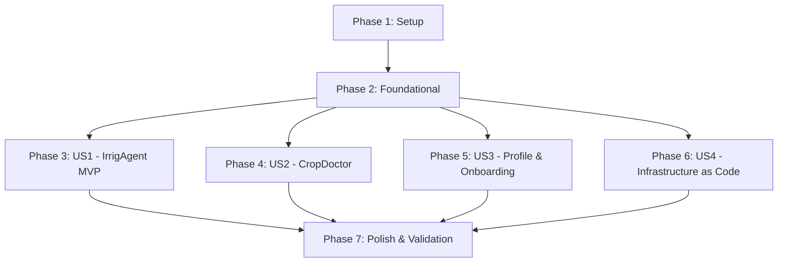

# Tasks: Hassan Persona - Proactive Irrigation Agent & Leaf Photo Triage

**Input**: Design documents from `/specs/001-hassan-irrigation-agent/`  
**Prerequisites**: [plan.md](plan.md), [spec.md](spec.md), [research.md](research.md), [data-model.md](data-model.md), [contracts/](contracts/), [quickstart.md](quickstart.md)

## Format: `[ID] [P?] [Story?] Description with file path`

- **[P]**: Can run in parallel (different files, no dependencies)
- **[Story]**: Maps to user story from spec.md ([US1], [US2], [US3], [US4])
- Includes exact file paths in descriptions

---

## Phase 1: Setup (Shared Infrastructure)

**Purpose**: Project initialization and directory structure

- [x] T001 Create project layout (`app/`, `tests/unit/`, `tests/integration/`) per implementation plan
- [x] T002 Initialize dependencies in `requirements.txt` (fastapi, uvicorn, httpx, google-cloud-firestore, google-genai, pydantic, python-dotenv)
- [x] T003 [P] Create `.env.example` with environment variable definitions in `.env.example`

---

## Phase 2: Foundational (Blocking Prerequisites)

**Purpose**: Core infrastructure that MUST be complete before ANY user story can be implemented

- [x] T004 Implement environment configuration loader and validator in `app/config.py`
- [x] T005 [P] Implement Firestore DB client & collection helpers (`farm_profiles`, `irrigation_recommendations`, `disease_triage_requests`) in `app/firestore_client.py`
- [x] T006 [P] Implement Meta WhatsApp Cloud API Graph API helper functions (`send_text_message` with 1 retry on delivery failure, `download_media`) in `app/whatsapp.py`
- [x] T007 Implement FastAPI app initialization, router setup, and GET `/webhook` handshake verification in `app/main.py`

**Checkpoint**: Foundation ready - user story implementation can now begin in parallel

---

## Phase 3: User Story 1 - Daily Proactive Irrigation Advisory & One-Tap Reply (Priority: P1) 🎯 MVP

**Goal**: Deliver a proactive evening irrigation advisory (19:00 GMT+1) via WhatsApp with one-tap reply options (`1` Approve, `2` Skip, `3` Modify).  
**Independent Test**: Trigger daily batch job (`POST /jobs/daily-recommendations`), verify WhatsApp message delivery, reply `1`, `2`, or `3 "+10 min at 05:00"`, and verify Firestore document status updates.

- [x] T008 [P] [US1] Implement Open-Meteo API client with 3 short-backoff retries (10s/30s/60s) and ET₀ baseline fallback in `app/weather.py`
- [x] T009 [P] [US1] Implement deterministic rule-based irrigation recommendation logic in `app/decision.py`
- [x] T010 [P] [US1] Implement narrow rule-based regex parser (`[+-]\d+\s*min`, `\d{1,2}:\d{2}|\d{1,2}h\d{0,2}`) for Option 3 modification text in `app/regex_parser.py`
- [x] T011 [US1] Implement daily recommendation batch execution endpoint (`POST /jobs/daily-recommendations`) in `app/main.py` (with 1 delivery retry & admin flagging on failure; depends on T008, T009)
- [x] T012 [US1] Implement POST `/webhook` event handler for incoming text replies (`1`, `2`, `3`) in `app/main.py` (depends on T010)
- [x] T013 [P] [US1] Unit tests for decision rules and regex parser in `tests/unit/test_decision.py` and `tests/unit/test_regex_parser.py`

**Checkpoint**: User Story 1 (Hero Feature MVP) fully functional and testable independently

---

## Phase 4: User Story 2 - CropDoctor Leaf Photo Disease Triage (Priority: P2)

**Goal**: Multimodal leaf photo disease triage via WhatsApp using Gemini 1.5 Flash, confidence-tiered safety rules, static ONSSA product lookup table, and mandatory disclaimer.  
**Independent Test**: Send a leaf photo via WhatsApp, verify diagnostic response text, static ONSSA product pointer (for High/Med confidence), product omission (for Low confidence), and verbatim ONSSA disclaimer.

- [x] T014 [P] [US2] Implement static ONSSA product lookup dictionary for pilot crops (tomatoes, citrus) in `app/cropdoctor.py`
- [x] T015 [US2] Implement Gemini 1.5 Flash vision client and confidence-tiered diagnosis generator (High/Med/Low rules) in `app/cropdoctor.py` (depends on T014)
- [x] T016 [US2] Integrate incoming WhatsApp image event handling in `app/main.py` (download image via `app/whatsapp.py`, execute CropDoctor triage, reply with verbatim ONSSA disclaimer)
- [x] T017 [P] [US2] Unit tests for CropDoctor confidence rules and static ONSSA lookup in `tests/unit/test_cropdoctor.py`

**Checkpoint**: User Stories 1 AND 2 both functional and testable independently

---

## Phase 5: User Story 3 - Farm Profile Setup & Management via WhatsApp (Priority: P3)

**Goal**: Zero-friction onboarding via WhatsApp with a dual-language initial greeting and rule-based Arabizi detection heuristic (`3`,`7`,`9`).  
**Independent Test**: Send a message from a new sandbox number, verify dual-language greeting, reply in Arabizi, and verify `preferred_language` auto-flips to Darija in Firestore.

- [x] T018 [US3] Implement rule-based Arabizi detection heuristic (`3`,`7`,`9` digit substitutions & Arabic script) in `app/firestore_client.py`
- [x] T019 [US3] Implement dual-language onboarding initial greeting and profile registration handler in `app/main.py` (depends on T018)
- [x] T020 [P] [US3] Integration test for webhook endpoints & onboarding flows in `tests/integration/test_webhook.py`

**Checkpoint**: All application user stories independently functional

---

## Phase 6: User Story 4 - Automated Infrastructure-as-Code Provisioning (Priority: P2) 🏗️ IaC

**Goal**: Declarative Infrastructure as Code for GCP cloud resources (`infra/` module using Terraform HCL) per Constitution Principle VII.  
**Independent Test**: Execute `terraform -chdir=infra init`, `validate`, and `plan` dry-run against a GCP project, verifying Cloud Run, Firestore Native, Cloud Scheduler 18:45 GMT+1, Secret Manager, and IAM service accounts with 0 errors.

- [ ] T021 [P] [US4] Implement Terraform input variables (`project_id`, `region`, `container_image`, secrets) in `infra/variables.tf`
- [ ] T022 [P] [US4] Implement Terraform GCP resources (`google_cloud_run_v2_service`, `google_firestore_database`, `google_cloud_scheduler_job`, `google_secret_manager_secret`, `google_service_account`, `google_project_iam_member`) in `infra/main.tf`
- [ ] T023 [P] [US4] Implement Terraform outputs (`cloud_run_url`, service account emails, database name) in `infra/outputs.tf`
- [ ] T024 [US4] Validate Terraform IaC module via `terraform -chdir=infra validate` and `terraform -chdir=infra plan` per `contracts/infra-contract.md` (depends on T021, T022, T023)

**Checkpoint**: Infrastructure-as-Code module fully specified, syntactically valid, and testable independently

---

## Phase 7: Polish & Cross-Cutting Concerns

**Purpose**: Production deployment readiness and runnable validation scenarios

- [x] T025 [P] Create Dockerfile for GCP Cloud Run deployment in `Dockerfile`
- [ ] T026 Run quickstart validation scenario suite against local app & Terraform module per `quickstart.md`
- [x] T027 [P] Final documentation review and code cleanup across `app/`, `infra/`, and `README.md`

---

## Dependencies & Execution Order

---

## Implementation Strategy

### MVP First (User Story 1 Only)
1. Complete Phase 1 (Setup) and Phase 2 (Foundational).
2. Complete Phase 3 (User Story 1: IrrigAgent MVP).
3. **STOP and VALIDATE**: Test User Story 1 end-to-end via `POST /webhook` and `POST /jobs/daily-recommendations`.

### Incremental Delivery
1. Foundation -> 2. IrrigAgent MVP -> 3. CropDoctor Module -> 4. Zero-Friction Onboarding -> 5. Infrastructure as Code (`infra/`) -> 6. Cloud Run Deploy.
