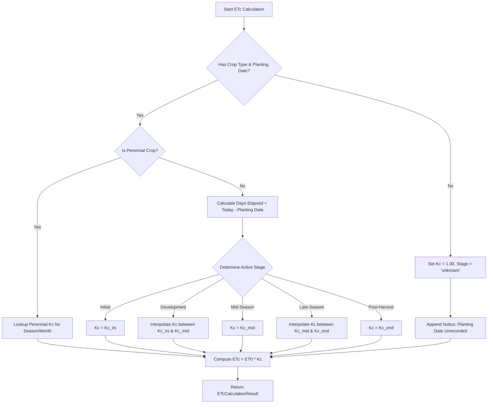

# Data Model: Crop-Specific ETc Calculation

**Feature**: `006-crop-etc-calculation`
**Date**: 2026-07-29

## Entities & Schemas

### 1. FAO-56 Crop Lookup Record (`FAO56CropEntry`)

Defines static reference parameters for supported crop types.

```python
class FAO56CropEntry(BaseModel):
    crop_type: str                  # Canonical key e.g., "tomatoes", "citrus", "watermelon"
    display_name: str               # Human readable name e.g., "Tomatoes (Industrial)"
    kc_ini: float                   # Initial stage crop coefficient
    kc_mid: float                   # Mid-season peak crop coefficient
    kc_end: float                   # Late-season end crop coefficient
    stage_lengths_days: Dict[str, int] # {"initial": 30, "dev": 40, "mid": 45, "late": 30}
    is_perennial: bool = False      # True for mature orchards (citrus, olives)
```

---

### 2. Farm Profile Crop Parameters (`FarmProfileCropMeta`)

Extension to Firestore farm profile document schema.

```python
class FarmProfileCropMeta(BaseModel):
    crop_type: str                  # Matching key in FAO56CropEntry catalog
    planting_date: Optional[str] = None # ISO format "YYYY-MM-DD"
    is_mature_orchard: bool = False # Flag for perennial trees
```

---

### 3. ETc Calculation Result (`ETcCalculationResult`)

Computed data structure returned by the ETc calculation engine.

```python
class ETcCalculationResult(BaseModel):
    et0_mm: float                   # Pulled reference evapotranspiration (Open-Meteo)
    kc_applied: float               # Calculated crop coefficient (interpolated)
    etc_mm: float                   # Resulting crop evapotranspiration (et0 * kc)
    growth_stage: str               # "initial", "development", "mid_season", "late_season", "post_harvest", or "unknown"
    days_since_planting: Optional[int] = None # Elapsed days
    notice: Optional[str] = None    # User-facing prompt if fallback applied
```

---

## State Transition & Calculation Flow


