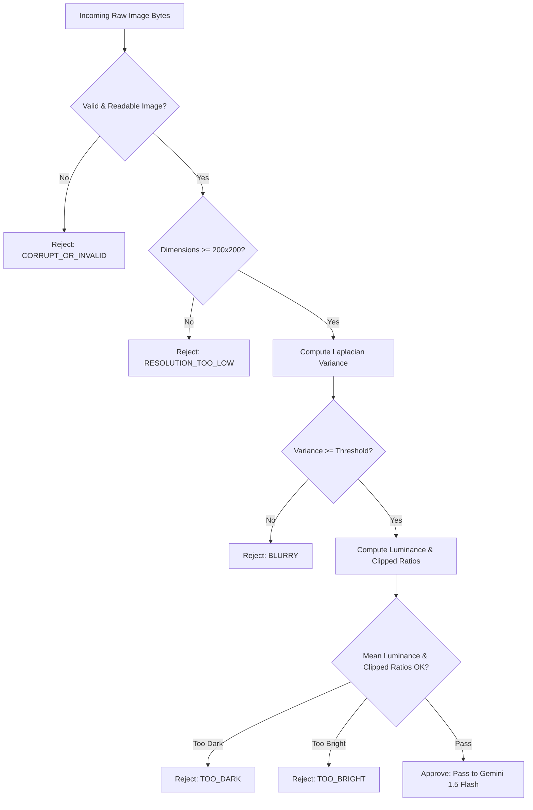

# Data Model & Domain Schemas: Image Pre-Filter OpenCV

**Feature**: `specs/007-image-prefilter-heuristics`  
**Date**: 2026-07-29

## Domain Entities & Schemas

### 1. QualityDefectReason (Enum)

Categorizes the primary defect identified when an image fails pre-filter evaluation.

| Code | Description | User Feedback Text (Darija/French Guidance) |
| :--- | :--- | :--- |
| `NONE` | Image passed all quality checks. | N/A |
| `CORRUPT_OR_INVALID` | Unreadable, zero-byte, or unsupported image bytes. | 🍃 *Photo Unreadable*: The uploaded file could not be opened. Please send a valid photo (JPEG or PNG). |
| `BLURRY` | Sharpness metric (Laplacian variance) below threshold. | 🍃 *Photo Out of Focus*: The leaf photo is blurry. Please hold your camera steady and retake a sharp, in-focus photo. |
| `TOO_DARK` | Mean luminance below minimum or extreme dark pixel ratio. | 🍃 *Photo Too Dark*: The photo is underexposed. Please retake the leaf photo in better daylight or use your camera flash. |
| `TOO_BRIGHT` | Mean luminance above maximum or extreme glare ratio. | 🍃 *Too Much Glare*: The photo has heavy glare or bright sunlight. Please shade the leaf or adjust your angle and retake. |
| `RESOLUTION_TOO_LOW` | Image dimensions below minimum operational resolution ($< 200 \times 200$ px). | 🍃 *Resolution Too Low*: The photo is too small for leaf analysis. Please send a higher resolution photo. |

---

### 2. PreFilterConfig (Dataclass / Schema)

Configurable parameters governing heuristic tolerances.

```python
from pydantic import BaseModel, Field

class PreFilterConfig(BaseModel):
    enabled: bool = Field(default=True, description="Master feature flag for pre-filter evaluation")
    blur_threshold: float = Field(default=100.0, description="Minimum Laplacian variance required for sharpness")
    min_mean_luminance: float = Field(default=40.0, description="Minimum mean grayscale intensity (0-255)")
    max_mean_luminance: float = Field(default=220.0, description="Maximum mean grayscale intensity (0-255)")
    max_dark_pixel_ratio: float = Field(default=0.40, description="Maximum allowed ratio of pixels < 15 intensity")
    max_bright_pixel_ratio: float = Field(default=0.35, description="Maximum allowed ratio of pixels > 245 intensity")
    min_width_px: int = Field(default=200, description="Minimum allowed image width in pixels")
    min_height_px: int = Field(default=200, description="Minimum allowed image height in pixels")
```

---

### 3. ImageQualityMetrics (Schema)

Detailed numerical output produced by pre-filter evaluation.

```python
class ImageQualityMetrics(BaseModel):
    width: int = Field(description="Width of image in pixels")
    height: int = Field(description="Height of image in pixels")
    laplacian_variance: float = Field(description="Computed sharpness score (higher is sharper)")
    mean_luminance: float = Field(description="Average grayscale brightness (0.0 to 255.0)")
    dark_pixel_ratio: float = Field(description="Ratio of near-black pixels (0.0 to 1.0)")
    bright_pixel_ratio: float = Field(description="Ratio of near-white/glare pixels (0.0 to 1.0)")
    latency_ms: float = Field(description="Total pre-filter execution time in milliseconds")
```

---

### 4. QualityCheckResult (Schema)

Complete evaluation result returned to calling services (`cropdoctor.py` or REST API endpoints).

```python
class QualityCheckResult(BaseModel):
    is_acceptable: bool = Field(description="True if image passed all heuristics and can proceed to AI classifier")
    defect_reason: QualityDefectReason = Field(default=QualityDefectReason.NONE, description="Primary quality defect if failed")
    user_feedback_text: Optional[str] = Field(default=None, description="Actionable retake instructions if failed")
    metrics: Optional[ImageQualityMetrics] = Field(default=None, description="Raw numerical diagnostics")
```

---

## State Transition & Execution Flow


