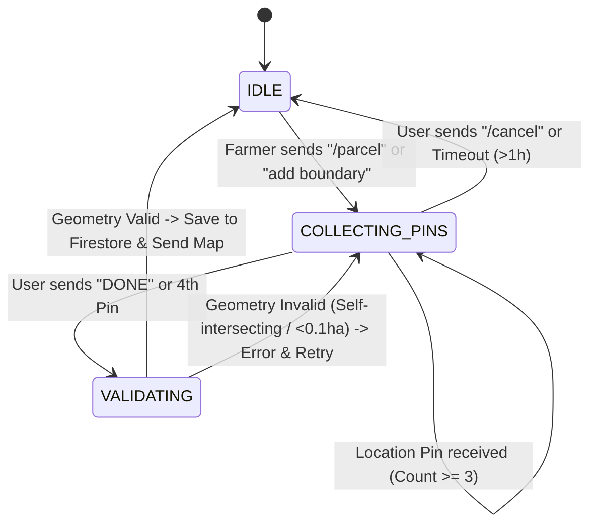

# Data Model: Sentinel-2 Canopy Heatmaps & Multi-Pin Parcel Collection

## Entities & Schemas

### 1. PinCollectionSession (Firestore: `farm_sessions/{phone_number}`)

Represents a stateful multi-turn WhatsApp location collection workflow.

| Field | Type | Description | Validation / Constraints |
|-------|------|-------------|--------------------------|
| `phone_number` | String | Farmer's WhatsApp phone number (E.164 format) | Primary key / document ID |
| `state` | String | Current conversation state | Values: `"IDLE"`, `"COLLECTING_PINS"`, `"VALIDATING"` |
| `pins` | List[Dict] | Recorded location pins | `[{"lat": float, "lon": float, "timestamp": ISOStr}, ...]` |
| `started_at` | String | ISO 8601 UTC timestamp of session start | Required |
| `updated_at` | String | ISO 8601 UTC timestamp of last pin addition | Auto-updated |

### 2. ParcelBoundary (Firestore: `farms/{phone_number}` -> field `parcel`)

GeoJSON representation of the validated farm parcel polygon.

```json
{
  "parcel": {
    "type": "Polygon",
    "coordinates": [
      [
        [ -9.5981, 30.4278 ],
        [ -9.5950, 30.4280 ],
        [ -9.5952, 30.4250 ],
        [ -9.5983, 30.4251 ],
        [ -9.5981, 30.4278 ]
      ]
    ],
    "area_hectares": 8.4,
    "perimeter_m": 1240.5,
    "updated_at": "2026-07-29T16:00:00Z"
  }
}
```

| Field | Type | Description | Validation / Constraints |
|-------|------|-------------|--------------------------|
| `type` | String | GeoJSON geometry type | Must be `"Polygon"` |
| `coordinates` | List[List[List[float]]] | Closed linear ring of [longitude, latitude] | First and last coordinate must be identical; minimum 4 points in ring |
| `area_hectares` | Float | Surface area calculated via Shoelace/geodesic formula | $0.1 \le \text{area\_hectares} \le 200.0$ |
| `perimeter_m` | Float | Total perimeter boundary length in meters | $\ge 0.0$ |
| `updated_at` | String | ISO 8601 UTC timestamp of last update | Required |

### 3. SentinelScene (In-Memory / Processing Entity)

Metadata for acquired satellite imagery scenes.

| Field | Type | Description |
|-------|------|-------------|
| `scene_id` | String | Copernicus Sentinel-2 tile acquisition ID |
| `acquisition_date` | String | ISO 8601 UTC sensing timestamp |
| `cloud_cover_percentage` | Float | Cloud cover percentage over parcel bounding box ($\le 20\%$) |
| `bbox` | List[float] | Bounding box coordinates `[min_lon, min_lat, max_lon, max_lat]` |
| `bands` | Dict[str, Any] | Matrices/arrays for Band 4 (Red) and Band 8 (NIR) |

### 4. CanopyHealthReport (Firestore / Pydantic Output Schema)

Output report delivered to the farmer via WhatsApp.

| Field | Type | Description |
|-------|------|-------------|
| `parcel_area_ha` | Float | Field area in hectares |
| `crop_type` | String | Registered crop name (e.g. "Tomatoes", "Citrus") |
| `capture_date` | String | Date of Sentinel-2 scene acquisition |
| `ndvi_mean` | Float | Average NDVI across field raster pixels |
| `healthy_percent` | Float | Percentage of pixels with $NDVI > 0.6$ (Dark Green) |
| `moderate_percent` | Float | Percentage of pixels with $0.3 \le NDVI \le 0.5$ (Yellow) |
| `stressed_percent` | Float | Percentage of pixels with $NDVI < 0.3$ (Red) |
| `recommendation` | String | Actionable irrigation/inspection advice |
| `media_id` | String | WhatsApp Meta Cloud API media identifier for uploaded heatmap PNG |

## Geometry State Transitions


