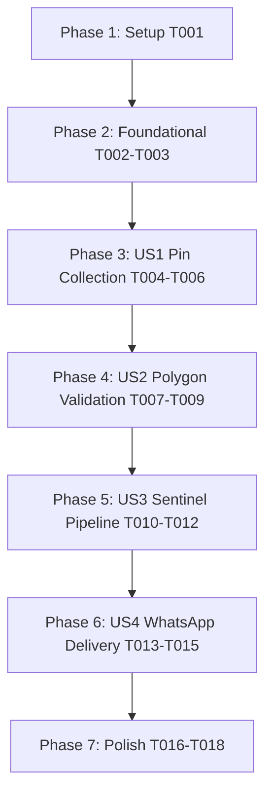

# Tasks: Sentinel-2 Canopy Heatmaps (Multi-Pin WhatsApp Interaction)

**Input**: Design documents from `/specs/008-sentinel-canopy-heatmaps/`

**Prerequisites**: [plan.md](file:///d:/rouca/DVM/workPlace/IrrigAgent/specs/008-sentinel-canopy-heatmaps/plan.md), [spec.md](file:///d:/rouca/DVM/workPlace/IrrigAgent/specs/008-sentinel-canopy-heatmaps/spec.md), [research.md](file:///d:/rouca/DVM/workPlace/IrrigAgent/specs/008-sentinel-canopy-heatmaps/research.md), [data-model.md](file:///d:/rouca/DVM/workPlace/IrrigAgent/specs/008-sentinel-canopy-heatmaps/data-model.md), [contracts/](file:///d:/rouca/DVM/workPlace/IrrigAgent/specs/008-sentinel-canopy-heatmaps/contracts/)

**Organization**: Tasks are grouped by user story to enable independent implementation and testing of each story.

## Format: `[ID] [P?] [Story] Description`

- **[P]**: Can run in parallel (different files, no dependencies)
- **[Story]**: Which user story this task belongs to (e.g., US1, US2, US3, US4)
- Include exact file paths in descriptions

---

## Phase 1: Setup (Shared Infrastructure)

**Purpose**: Project dependencies and setup validation

- [x] T001 Verify project environment dependencies (Shapely, NumPy, Pillow/Rasterio, Pytest) in `requirements.txt`

---

## Phase 2: Foundational (Blocking Prerequisites)

**Purpose**: Core data schemas and Firestore persistence helpers required across all user stories

**⚠️ CRITICAL**: No user story work can begin until this phase is complete

- [x] T002 [P] Add Pydantic data schemas (`PinSession`, `ParcelBoundary`, `SentinelScene`, `CanopyHealthReport`) in `app/schemas.py`
- [x] T003 [P] Extend Firestore client for session persistence (`save_pin_session`, `get_pin_session`, `delete_pin_session`, `save_farm_parcel`) in `app/firestore_client.py`

**Checkpoint**: Core foundation ready - user story implementation can begin.

---

## Phase 3: User Story 1 - Multi-Pin WhatsApp Parcel Boundary Collection (Priority: P1) 🎯 MVP

**Goal**: Collect field corner location pins step-by-step via WhatsApp location attachments.

**Independent Test**: Send "/parcel" to WhatsApp bot, send location attachments sequentially, verify pins stored and prompt returned for next pin corner.

### Tests & Implementation for User Story 1

- [x] T004 [P] [US1] Create unit tests for location pin state machine transitions in `tests/unit/test_parcel_pin_collection.py`
- [x] T005 [US1] Add regex pattern matchers for "/parcel", "add boundary", "/cancel", and "DONE" in `app/regex_parser.py`
- [x] T006 [US1] Implement WhatsApp location attachment handler and pin state machine handler (`COLLECTING_PINS`) in `app/main.py`

**Checkpoint**: User Story 1 fully functional and testable independently.

---

## Phase 4: User Story 2 - Automated Parcel Polygon Validation & Persistence (Priority: P1) 🎯 MVP

**Goal**: Validate polygon geometry ($N \ge 3$, simple non-self-intersecting polygon, Shoelace area calculation bounded 0.1–200 ha), persist GeoJSON in Firestore, and send map confirmation.

**Independent Test**: Send 4 location pins followed by "DONE", verify polygon validation passes, Shoelace area calculation returns expected hectares, and GeoJSON is stored in Firestore.

### Tests & Implementation for User Story 2

- [x] T007 [P] [US2] Create unit tests for Shoelace area calculation and Shapely `is_simple` self-intersection checks in `tests/unit/test_parcel_pin_collection.py`
- [x] T008 [US2] Implement Shoelace area math and Shapely boundary validation module in `app/parcel_validation.py`
- [x] T009 [US2] Integrate polygon validation into "DONE" closure workflow and persist GeoJSON parcel in `app/main.py`

**Checkpoint**: User Stories 1 AND 2 complete the parcel boundary setup flow.

---

## Phase 5: User Story 3 - Sentinel-2 Satellite Canopy Heatmap Pipeline (Priority: P2)

**Goal**: Fetch Sentinel-2 L2A imagery, compute NDVI matrix, map to high-contrast foliage colors, clip to parcel polygon, and render output graphic with overlays.

**Independent Test**: Pass parcel GeoJSON into Sentinel pipeline, verify NDVI array math, color mapping (Red $\le 0.3$, Yellow $0.3-0.5$, Dark Green $> 0.6$), raster clipping, and output PNG creation.

### Tests & Implementation for User Story 3

- [x] T010 [P] [US3] Create unit tests for NDVI band matrix math, color mapping, and polygon raster masking in `tests/unit/test_sentinel_canopy_heatmap.py`
- [x] T011 [US3] Implement Sentinel-2 L2A satellite retrieval, NDVI computation, and raster clipping module in `app/sentinel.py`
- [x] T012 [US3] Implement high-contrast color heatmap renderer with polygon border stroke, farm watermark, date stamp, and scale legend bar in `app/sentinel.py`

**Checkpoint**: Canopy heatmap rendering pipeline fully operational.

---

## Phase 6: User Story 4 - WhatsApp Canopy Report Delivery & Actionable Triage (Priority: P2)

**Goal**: Upload rendered PNG heatmap image to Meta Cloud API media endpoints, generate canopy status metrics, and dispatch image message with actionable irrigation advice over WhatsApp.

**Independent Test**: Trigger "/heatmap" request over WhatsApp webhook simulation, verify Meta Cloud API media upload and image caption dispatch.

### Tests & Implementation for User Story 4

- [x] T013 [P] [US4] Create integration tests for WhatsApp canopy report media upload and caption delivery in `tests/integration/test_whatsapp_sentinel_flow.py`
- [x] T014 [US4] Extend Meta Cloud API client with `upload_whatsapp_media` and `send_whatsapp_image` in `app/whatsapp.py`
- [x] T015 [US4] Wire `/heatmap` command trigger to Sentinel-2 rendering pipeline and media dispatch in `app/main.py`

**Checkpoint**: End-to-end multi-pin collection and Sentinel-2 canopy heatmap delivery functional on WhatsApp.

---

## Phase 7: Polish & Cross-Cutting Concerns

**Purpose**: Verification and validation across all user stories

- [x] T016 [P] Create manual verification script in `scripts/demo_sentinel_heatmap.py` to preview rendered PNG locally
- [x] T017 Execute full automated test suite (`pytest tests/`) to ensure 100% pass rate
- [x] T018 Validate end-to-end feature readiness against `specs/008-sentinel-canopy-heatmaps/quickstart.md`

---

## Dependencies & Execution Order

---

## Parallel Opportunities

- **Foundational**: `T002` (`app/schemas.py`) and `T003` (`app/firestore_client.py`) can run in parallel.
- **User Story 1**: `T004` (`tests/unit/test_parcel_pin_collection.py`) can run in parallel with setup.
- **User Story 2**: `T007` (`tests/unit/test_parcel_pin_collection.py`) can run in parallel with model tasks.
- **User Story 3**: `T010` (`tests/unit/test_sentinel_canopy_heatmap.py`) can run in parallel.
- **User Story 4**: `T013` (`tests/integration/test_whatsapp_sentinel_flow.py`) can run in parallel.
- **Polish**: `T016` (`scripts/demo_sentinel_heatmap.py`) can run in parallel with documentation.

---

## Implementation Strategy

### MVP First (User Stories 1 & 2)
1. Complete Phase 1 (Setup) and Phase 2 (Foundational schemas & Firestore persistence).
2. Complete Phase 3 (US1 Multi-Pin Collection) and Phase 4 (US2 Polygon Validation).
3. **STOP and VALIDATE**: Verify field corners can be sent over WhatsApp, validated via Shoelace/Shapely, and saved as GeoJSON.

### Full Feature Incremental Delivery
1. Add Phase 5 (US3 Sentinel-2 NDVI calculation and heatmap graphic rendering).
2. Add Phase 6 (US4 Meta Cloud API media upload & WhatsApp report dispatch).
3. Run Phase 7 (Polish & 100% pytest test suite verification).
