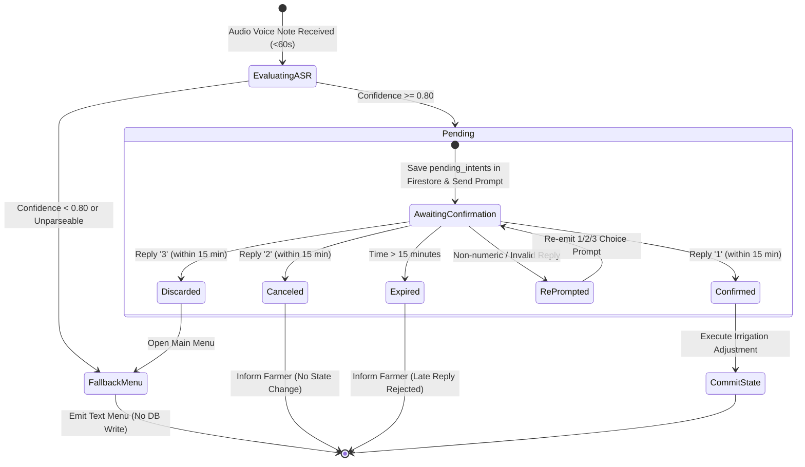

# Data Model: Voice-to-Intent Darija STT Safety Policy & Confirmation Prompts

## Firestore Collections & Schemas

### Collection: `pending_intents`

Document ID format: `pending_{phone_number}` (e.g. `pending_212600000000`)

```json
{
  "pending_voice_intent": {
    "intent_type": "MODIFY_IRRIGATION",
    "proposed_adjustment_minutes": 15,
    "confidence_score": 0.88,
    "transcribed_text": "Zid 15 dqiqa f l-sqi ghadan",
    "created_at": "2026-07-29T16:10:00Z",
    "expires_at": "2026-07-29T16:25:00Z",
    "status": "AWAITING_CONFIRMATION"
  }
}
```

### Field Definitions

| Field Name | Type | Description | Validation / Constraints |
|------------|------|-------------|--------------------------|
| `pending_voice_intent` | Map / Dict | Root pending intent map | Required object containing intent parameters |
| `pending_voice_intent.intent_type` | String | Type of requested irrigation intent | Enum: `MODIFY_IRRIGATION`, `INCREASE_IRRIGATION`, `DECREASE_IRRIGATION`, `SKIP_IRRIGATION` |
| `pending_voice_intent.proposed_adjustment_minutes` | Integer | Proposed irrigation duration adjustment in minutes | Required integer (e.g. `15`, `-10`, `0`) |
| `pending_voice_intent.confidence_score` | Float | Speech recognition confidence score | Required, range $[0.0, 1.0]$ ($\ge 0.80$ for pending storage) |
| `pending_voice_intent.transcribed_text` | String | Transcribed Darija speech text from ASR | Required string |
| `pending_voice_intent.created_at` | String (ISO 8601) | Timestamp when intent was created | UTC ISO format, e.g. `2026-07-29T16:10:00Z` |
| `pending_voice_intent.expires_at` | String (ISO 8601) | Timestamp when intent expires | UTC ISO format (`created_at` + 15 minutes) |
| `pending_voice_intent.status` | String | Lifecycle state of the pending intent | Enum: `AWAITING_CONFIRMATION`, `CONFIRMED`, `CANCELED`, `EXPIRED` |

---

## State Transition Diagram



---

## Entity Relationships

- **Farmer Profile** (`1`) $\longleftrightarrow$ (`0..1`) **Active Pending Intent**
  - Keyed by `phone_number`. Only one active `pending` intent can exist per phone number. Sending a new voice note overwrites/supersedes any active pending intent for that phone number.
