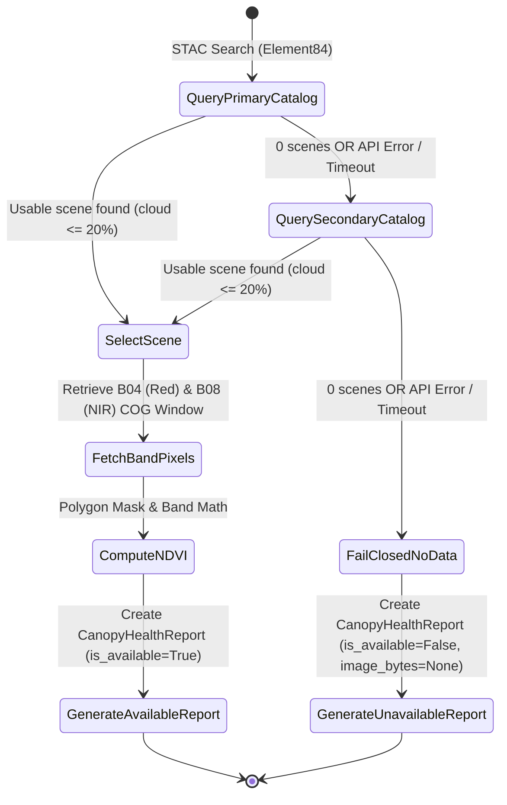

# Data Model: Real Sentinel Imagery Discovery and NDVI Computation

**Feature**: `011-real-sentinel-ndvi` | **Date**: 2026-07-30

## 1. Entities & Schemas

### `SentinelSceneMetadata` (Internal Dataclass/Model)
Represents a candidate satellite scene returned from STAC catalog discovery.

| Field Name | Type | Description | Validation / Constraints |
|------------|------|-------------|--------------------------|
| `scene_id` | `str` | Unique STAC scene identifier | Non-empty string |
| `acquisition_date` | `str` | True capture date (ISO 8601 string, e.g. `2026-07-28`) | Valid ISO date |
| `cloud_cover_percent` | `float` | True cloud cover percentage of scene | `0.0 <= cloud_cover <= 100.0` |
| `red_band_url` | `str` | COG asset URL for Band 04 (Red) | Valid HTTP/HTTPS URL |
| `nir_band_url` | `str` | COG asset URL for Band 08 (NIR) | Valid HTTP/HTTPS URL |
| `catalog_source` | `str` | Origin STAC catalog (`element84` or `copernicus`) | Non-empty string |

---

### `CanopyHealthReport` (Pydantic Schema in `app/schemas.py`)
Represents the canopy health assessment output delivered to farm managers.

| Field Name | Type | Default | Description |
|------------|------|---------|-------------|
| `parcel_area_ha` | `float` | Required | Field area in hectares |
| `crop_type` | `str` | `"Tomatoes"` | Crop category name |
| `capture_date` | `str` | Required | Actual satellite capture date (`YYYY-MM-DD`) or search range |
| `cloud_cover_percent` | `float` | `0.0` | True cloud cover percentage of selected scene |
| `ndvi_mean` | `float` | Required | Mean NDVI value across field polygon pixels |
| `healthy_percent` | `float` | Required | Percentage of field pixels with NDVI > 0.5 |
| `moderate_percent` | `float` | Required | Percentage of field pixels with 0.3 < NDVI <= 0.5 |
| `stressed_percent` | `float` | Required | Percentage of field pixels with NDVI <= 0.3 |
| `recommendation` | `str` | Required | Actionable advice text or fail-closed explanation |
| `media_id` | `Optional[str]` | `None` | WhatsApp uploaded media ID |
| `image_bytes` | `Optional[bytes]` | `None` | Heatmap PNG image binary bytes (None when `is_available=False`) |
| `is_available` | `bool` | `True` | `True` if real imagery processed; `False` if fail-closed |
| `no_data_reason` | `Optional[str]` | `None` | Rationale when `is_available=False` |

---

## 2. State Transitions & Fail-Closed Protocol

