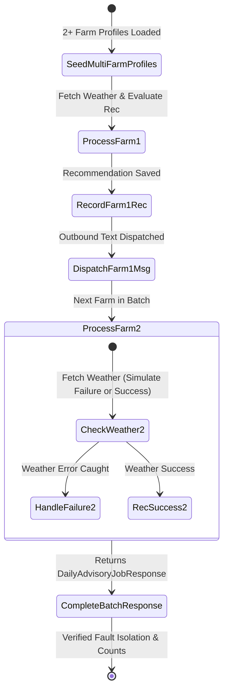

# Data Model & Test Entities: MVP Polish — WhatsApp Client Unit Tests & Multi-Farm Batch Integration Test

**Feature Branch**: `013-mvp-polish-whatsapp-batch-tests`  
**Date**: 2026-07-31  

---

## Entities & Test Payloads

### 1. WhatsApp Outbound Text Payload (`WhatsAppOutboundText`)
Represents the request payload formatted by `send_text_message()` before transmission to Meta Graph API `MESSAGES_URL`.

| Field | Type | Validation Rules | Description |
| :--- | :--- | :--- | :--- |
| `messaging_product` | `str` | Must equal `"whatsapp"` | Platform identifier required by Meta |
| `to` | `str` | Non-empty E.164 phone string (e.g. `"+212600000001"`) | Recipient phone number |
| `type` | `str` | Must equal `"text"` | Message payload type |
| `text.body` | `str` | Non-empty text string | Advisory or message content |

### 2. WhatsApp Outbound Media Upload Request (`WhatsAppMediaUpload`)
Represents the multipart form payload sent by `upload_media()` to Meta Graph API `/media`.

| Field | Type | Validation Rules | Description |
| :--- | :--- | :--- | :--- |
| `file` | `tuple` | `(filename, bytes, mime_type)` | Media binary contents |
| `messaging_product` | `str` | Must equal `"whatsapp"` | Platform identifier |
| `type` | `str` | Valid MIME type (e.g. `"audio/ogg; codecs=opus"`, `"image/png"`) | Content type header |

### 3. WhatsApp Webhook Inbound Payload (`WhatsAppWebhookInbound`)
Parsed by `extract_incoming_message(payload)`.

| Event Type | Key Fields | Expected Extraction Result |
| :--- | :--- | :--- |
| **Text Message** | `type: "text"`, `text.body: "1"`, `from: "212612345678"` | `{"from": "...", "type": "text", "text": "1", ...}` |
| **Image Message** | `type: "image"`, `image.id: "media_123"` | `{"from": "...", "type": "image", "image_id": "media_123", ...}` |
| **Audio/Voice** | `type: "audio"`, `audio.id: "media_456"`, `audio.seconds: 12` | `{"from": "...", "type": "audio", "audio_id": "media_456", "audio_duration": 12, ...}` |
| **Status Callback** | No `messages` key in `changes[0].value` | Returns `None` |
| **Malformed JSON** | Missing `entry` / `changes` arrays | Returns `None` (rescued safely) |

---

## Multi-Farm Test Fixture Batch Data Model

### 1. Farm Profile Fixture Set (`FarmProfileFixtures`)
Used to seed multi-farm batch execution tests in `test_daily_batch_multi_farm.py`.

```json
[
  {
    "phone_number": "+212611111111",
    "crop_type": "tomatoes",
    "acreage_hectares": 10.0,
    "location": {"latitude": 30.4278, "longitude": -9.5981},
    "preferred_language": "french"
  },
  {
    "phone_number": "+212622222222",
    "crop_type": "citrus",
    "acreage_hectares": 25.0,
    "location": {"latitude": 34.8941, "longitude": -2.3278},
    "preferred_language": "darija"
  }
]
```

### 2. Multi-Farm Batch Execution State Transitions


