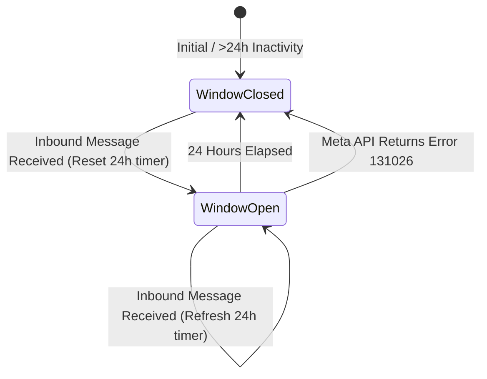

# Data Model: WhatsApp 24-Hour Customer Service Window Compliance

## Entities & Schemas

### 1. User Window State Entity (`CustomerServiceWindow`)

Tracks customer service window status and inbound message history per WhatsApp recipient.

#### Fields
- `phone_number` (`str`): Primary identifier (E.164 format, e.g. `"212600000000"`).
- `last_inbound_timestamp` (`datetime` | `str`): ISO-8601 UTC timestamp of the most recent inbound message received from the user.
- `window_active` (`bool`): Calculated status (`true` if `(now - last_inbound_timestamp) < 24h`, else `false`).
- `last_dispatch_mode` (`str`): `"free_form"` or `"template"`.
- `last_error_code` (`int` | `None`): Recorded Meta Graph API error code (e.g. `131026` if rejected).

#### State Transitions


---

### 2. WhatsApp Advisory Template Schema (`AdvisoryMessageTemplate`)

Represents the payload specification for Meta-approved outbound template messages.

#### Fields
- `template_name` (`str`): Registered template name in Meta WhatsApp Business Manager (default: `"daily_irrigation_advisory"`).
- `language_code` (`str`): ISO language code (default: `"fr"`).
- `category` (`str`): Meta template category (`"UTILITY"`).
- `components` (`list[dict]`): Ordered list of template components (e.g., body parameters).
- `parameters` (`list[str]`): Positional string array matching template placeholders:
  - `{{1}}`: Farm Name (e.g., `"Ferme Hassan"`)
  - `{{2}}`: Calculated ET₀ Recommendation (e.g., `"4.5 mm/jour"`)
  - `{{3}}`: Recommended Irrigation Duration (e.g., `"45 min"`)

---

### 3. Outbound Message Payload Union (`WhatsAppOutboundPayload`)

Unified payload representation in `app/whatsapp.py`.

```python
class WhatsAppTextPayload(BaseModel):
    messaging_product: str = "whatsapp"
    to: str
    type: str = "text"
    text: Dict[str, str]

class WhatsAppTemplatePayload(BaseModel):
    messaging_product: str = "whatsapp"
    to: str
    type: str = "template"
    template: Dict[str, Any]
```
