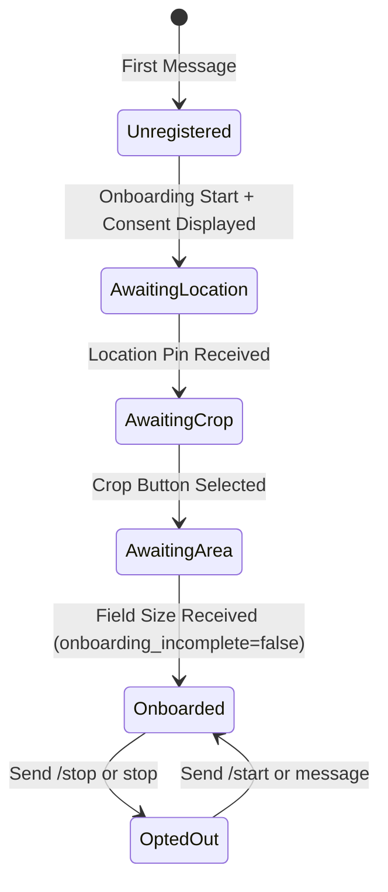

# Data Model: v1.0 Farmer UX Polish, Code Quality Cleanup, and Outcome-Data Foundation

**Feature Directory**: `specs/017-farmer-ux-polish-outcome-data`  
**Date**: 2026-07-31  

---

## 1. Firestore Schema Extensions

### 1.1 `FarmProfile` Entity (`farms/{phone_number}`)

Represents a registered farmer's profile in Firestore.

| Field Name | Type | Default | Description |
|---|---|---|---|
| `phone_number` | `string` | *Required* | Primary key (E.164 format, e.g. `+212600000000`). |
| `farm_name` | `string` | `"Ferme Hassan"` | Display name of the farm. |
| `location` | `map` | `{"lat": 30.4278, "lng": -9.5981}` | Latitude and longitude coordinates. |
| `crop_type` | `string` | `"Tomatoes"` | Primary crop type. |
| `field_size_ha` | `number` | `10.0` | Parcel area in hectares. |
| `preferred_language` | `string` | `"fr"` | Language preference (`fr`, `ar`, `en`). |
| `opted_out` | `boolean` | `false` | When `true`, farm is excluded from automated daily advisory batch runs. |
| `onboarding_incomplete` | `boolean` | `false` | When `true`, profile is using temporary defaults and receives setup reminders. |
| `onboarding_step` | `string` | `"COMPLETED"` | State tracking (`AWAITING_LOCATION`, `AWAITING_CROP`, `AWAITING_AREA`, `COMPLETED`). |
| `consent_accepted` | `boolean` | `true` | Indicates farmer accepted data usage terms during onboarding. |

---

### 1.2 `IrrigationRecommendation` Entity (`recommendations/{recommendation_id}`)

Represents a daily irrigation advisory generated and dispatched to a farm.

| Field Name | Type | Default | Description |
|---|---|---|---|
| `recommendation_id` | `string` | *Required* | Unique recommendation ID (e.g. `rec_20260731_212600000000`). |
| `farm_id` | `string` | *Required* | Associated farm phone number. |
| `date` | `string` | *Required* | Date of advisory (`YYYY-MM-DD`). |
| `et0_mm` | `number` | `0.0` | Reference Evapotranspiration in mm. |
| `etc_mm` | `number` | `0.0` | Crop Evapotranspiration in mm. |
| `recommended_action` | `string` | `"approve_standard"` | Action code (`approve_standard`, `adjust_water`, `skip_rain`). |
| `duration_minutes` | `number` | `45` | Recommended irrigation duration in minutes. |
| `outcome_feedback` | `string` | `"no_response"` | Compliance response: `yes` (or `followed`), `less`, `more`, `skipped`, or `no_response`. |
| `outcome_updated_at` | `string` | `null` | ISO 8601 timestamp when feedback was recorded. |

---

### 1.3 `PendingVoiceIntent` Entity (`farms/{phone_number}/pending_intent`)

Represents an unconfirmed action proposed following a voice note transcription.

| Field Name | Type | Default | Description |
|---|---|---|---|
| `intent_id` | `string` | *Required* | Unique intent identifier. |
| `phone_number` | `string` | *Required* | Target farm phone number. |
| `intent_type` | `string` | `"MODIFY_IRRIGATION"` | Proposed intent type (`MODIFY_IRRIGATION`, `SKIP_IRRIGATION`, etc.). |
| `proposed_adjustment_minutes` | `number` | `15` | Proposed duration delta in minutes. |
| `transcribed_text` | `string` | `""` | Raw STT transcription text from voice note. |
| `confidence_score` | `number` | `0.0` | Model confidence score (0.0 to 1.0). |
| `status` | `string` | `"AWAITING_CONFIRMATION"` | Intent state (`AWAITING_CONFIRMATION`, `CONFIRMED`, `CANCELED`, `EXPIRED`). |
| `created_at` | `string` | ISO string | Timestamp when voice note was processed. |

---

## 2. State Machine Transitions

