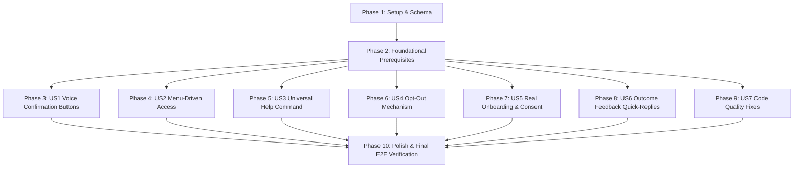

# Tasks: v1.0 Farmer UX Polish, Code Quality Cleanup, and Outcome-Data Foundation

**Input**: Design documents from `/specs/017-farmer-ux-polish-outcome-data/`  
**Prerequisites**: [plan.md](file:///d:/rouca/DVM/workPlace/IrrigAgent/specs/017-farmer-ux-polish-outcome-data/plan.md), [spec.md](file:///d:/rouca/DVM/workPlace/IrrigAgent/specs/017-farmer-ux-polish-outcome-data/spec.md), [research.md](file:///d:/rouca/DVM/workPlace/IrrigAgent/specs/017-farmer-ux-polish-outcome-data/research.md), [data-model.md](file:///d:/rouca/DVM/workPlace/IrrigAgent/specs/017-farmer-ux-polish-outcome-data/data-model.md), [contracts/](file:///d:/rouca/DVM/workPlace/IrrigAgent/specs/017-farmer-ux-polish-outcome-data/contracts/)

---

## Phase 1: Setup & Data Model Extensions

**Purpose**: Extend Firestore entity schemas to support opt-out, onboarding state, and outcome feedback.

- [x] T001 [P] Extend `FarmProfile` model helper functions to include `opted_out`, `onboarding_incomplete`, `onboarding_step`, and `consent_accepted` in `app/firestore_client.py`
- [x] T002 [P] Extend `IrrigationRecommendation` model helper functions to include `outcome_feedback` and `outcome_updated_at` in `app/firestore_client.py`

---

## Phase 2: Foundational Prerequisites

**Purpose**: Core WhatsApp interactive button dispatch and payload routing prerequisites.

- [x] T003 Extend WhatsApp interactive button webhook handler to route inbound button tap IDs (`CONFIRM_VOICE_INTENT`, `CANCEL_VOICE_INTENT`, `MENU_*`, `CROP_*`, `FB_*`) in `app/main.py`

---

## Phase 3: User Story 1 - Voice-Confirmation Interactive Buttons (Priority: P1) 🎯 MVP

**Goal**: Enable farmers to confirm or cancel voice note intent proposals via interactive button taps or text replies.

**Independent Test**: Send voice note, receive confirmation prompt with buttons, tap "Confirm" button, verify intent resolves identically to typing "1".

- [x] T004 [P] [US1] Add unit tests for voice intent confirmation button payload rendering and button-tap/text reply equivalence in `tests/unit/test_voice_darija_stt.py`
- [x] T005 [US1] Update `process_voice_note()` to render interactive "Confirm" and "Cancel" buttons when conversation window is open in `app/decision.py`
- [x] T006 [US1] Update `process_pending_intent_reply()` to handle interactive button payloads (`CONFIRM_VOICE_INTENT`, `CANCEL_VOICE_INTENT`) in `app/decision.py`

---

## Phase 4: User Story 2 - Menu-Driven Access to Features (Priority: P1)

**Goal**: Expose field boundary setup (`/parcel`), crop health (`/heatmap`), and profile update options as tappable menu buttons.

**Independent Test**: Request help, tap `🗺️ Setup Boundary` button, verify seamless entry into field boundary setup flow.

- [x] T007 [P] [US2] Add unit tests for interactive menu rendering and button selection routing in `tests/unit/test_help_menu_buttons.py`
- [x] T008 [US2] Implement interactive button/list menu builder for `/help` response in `app/main.py`
- [x] T009 [US2] Wire menu button selection callbacks (`MENU_PARCEL`, `MENU_HEATMAP`, `MENU_PROFILE`) to existing feature flows in `app/main.py`

---

## Phase 5: User Story 3 - Always-Available Help/Menu Command (Priority: P1)

**Goal**: Recognize `/help`, `help`, `menu` across all conversation states and append persistent help hints to output messages.

**Independent Test**: Send `help` from any active conversation state and verify localized menu response.

- [x] T010 [P] [US3] Add unit tests for universal `/help`/`menu` command handling and persistent hint formatting in `tests/unit/test_help_menu_buttons.py`
- [x] T011 [US3] Update command router in `app/main.py` to handle universal help triggers across all conversation states
- [x] T012 [US3] Append persistent closing hint ("Reply help anytime for options") to daily advisory and CropDoctor outputs in `app/decision.py`

---

## Phase 6: User Story 4 - Product-Level Opt-Out & Opt-In Mechanism (Priority: P1)

**Goal**: Allow farmers to opt out of daily messages via `/stop` and opt back in via `/start`.

**Independent Test**: Send `/stop`, verify profile `opted_out == True`, run daily batch recommendation job to confirm exclusion, send `/start` to verify opt-in.

- [x] T013 [P] [US4] Add unit tests for `/stop`, `/start`, and daily batch recommendation job exclusion in `tests/unit/test_opt_out_flow.py`
- [x] T014 [US4] Implement `/stop` and `/start` command routing and Firestore `opted_out` status updates in `app/main.py`
- [x] T015 [US4] Update daily recommendation batch job in `app/jobs.py` to filter out profiles where `opted_out == True`

---

## Phase 7: User Story 5 - Real Onboarding Data Collection & Explicit Data Consent (Priority: P1)

**Goal**: Collect real location pin, crop type, and field size during onboarding with plain-language data consent text.

**Independent Test**: Register new farmer, complete onboarding pin/crop/size prompts, verify consent text in greeting and profile persistence without hardcoded defaults.

- [x] T016 [P] [US5] Add unit tests for location pin, crop selection, field size prompts, explicit consent greeting, and `onboarding_incomplete` flag in `tests/unit/test_onboarding_consent.py`
- [x] T017 [US5] Implement sequential onboarding state machine and plain-language consent statement in `app/main.py`
- [x] T018 [US5] Append setup reminder line to daily advisory outputs when `onboarding_incomplete == True` in `app/decision.py`

---

## Phase 8: User Story 6 - Outcome-Feedback Quick-Reply Data Capture (Priority: P2)

**Goal**: Capture irrigation compliance feedback ("Yes", "Less", "More", "Skipped") using WhatsApp quick-reply buttons.

**Independent Test**: Tap "Yes" quick-reply button following an advisory, verify Firestore record updated with `outcome_feedback: "yes"`.

- [x] T019 [P] [US6] Add unit tests for outcome feedback quick-reply button prompt delivery and Firestore persistence in `tests/unit/test_outcome_feedback.py`
- [x] T020 [US6] Implement 4-option outcome feedback quick-reply button message payload generation (titles $\le 20$ chars: `"Yes"`, `"Less"`, `"More"`, `"Skipped"`) in `app/main.py`
- [x] T021 [US6] Wire feedback button tap payload handling (`FB_YES`, `FB_LESS`, `FB_MORE`, `FB_SKIPPED`) to update `outcome_feedback` in `app/firestore_client.py`

---

## Phase 9: User Story 7 - Code Quality & Robustness Cleanup (Priority: P2)

**Goal**: Fix code smells in voice JSON stripping (SMELL-001), Sentinel-2 band shape alignment (SMELL-002), and dynamic GenAI imports (SMELL-003).

**Independent Test**: Run targeted unit tests for SMELL-001, SMELL-002, and SMELL-003 to confirm fixes lock in clean behavior.

- [x] T022 [P] [US7] Add unit test for SMELL-001 markdown code fence JSON stripping in `tests/unit/test_voice_darija_stt.py`
- [x] T023 [US7] Replace fragile string stripping with regex/removeprefix/removesuffix in `parse_voice_intent()` in `app/decision.py`
- [x] T024 [P] [US7] Add unit test for SMELL-002 Sentinel-2 band array shape alignment in `tests/unit/test_sentinel_canopy_heatmap.py`
- [x] T025 [US7] Pass explicit `out_shape` to both `src_red.read()` and `src_nir.read()` in `fetch_sentinel2_bands()` in `app/sentinel.py`
- [x] T026 [P] [US7] Replace dynamic `importlib.import_module("google.genai")` calls with direct static import in `app/decision.py`

---

## Phase 10: Polish & Cross-Cutting Concerns

**Purpose**: Verification and final test suite execution.

- [x] T027 [P] Execute full test suite (`pytest tests/`) to ensure 100% pass rate with zero regressions
- [x] T028 Validate quickstart scenarios per `specs/017-farmer-ux-polish-outcome-data/quickstart.md`

---

## Dependencies & Execution Order

---

## Implementation Strategy & MVP Scope

- **MVP First (User Story 1)**: Complete Phase 1, Phase 2, and Phase 3 (US1). Validate voice intent interactive confirmation independently.
- **Incremental Delivery**: Add US2 (Menu), US3 (Help), US4 (Opt-out), US5 (Onboarding & Consent), US6 (Outcome Feedback), and US7 (Code Quality Fixes) step-by-step, running unit tests after each task.
