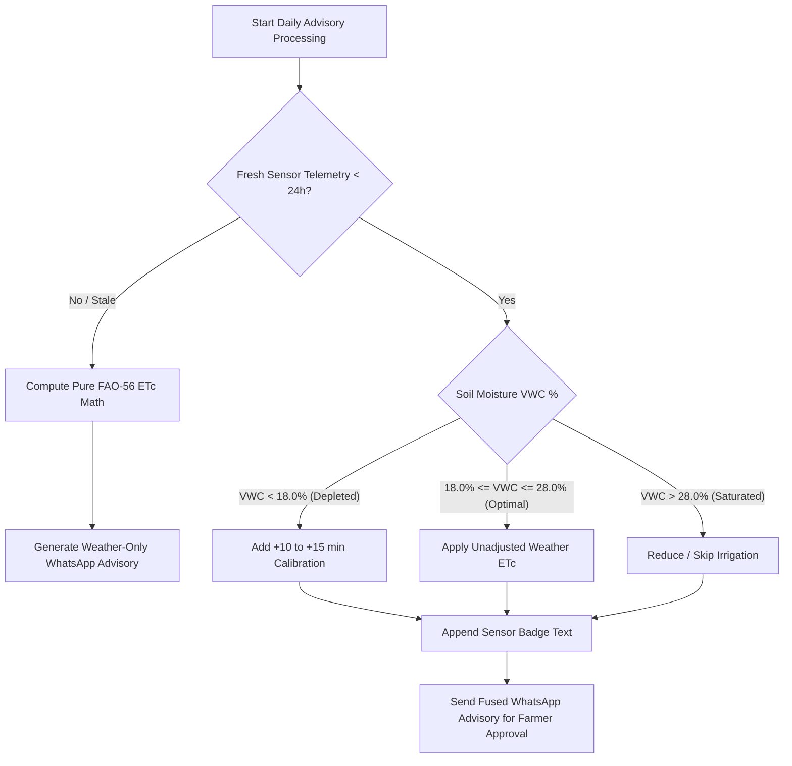

# Data Model: Closed-Loop Sensor Fusion Telemetry & Decision Calibration

**Feature Branch**: `017-sensor-fusion-poc`  
**Created**: 2026-07-31  
**Spec Reference**: [spec.md](file:///d:/rouca/DVM/workPlace/IrrigAgent/specs/017-sensor-fusion-poc/spec.md)

---

## Data Entities & Schemas

### 1. `SensorTelemetryPayload` (Inbound REST API Payload)

Pydantic v2 schema representing raw telemetry received from an IoT sensor probe or simulation script.

| Field | Type | Validation Rules | Description |
|---|---|---|---|
| `farm_id` | `str` | Non-empty string (WhatsApp phone number format) | Identifies target farm profile |
| `timestamp` | `datetime` | Valid ISO 8601 string | Time when probe reading was captured |
| `soil_moisture_vwc` | `float` | $0.0 \le \text{soil\_moisture\_vwc} \le 100.0$ | Volumetric Water Content percentage ($\text{VWC}\%$) |
| `depth_cm` | `int` | $1 \le \text{depth\_cm} \le 200$, Default: `15` | Soil probe depth in centimeters |
| `battery_level` | `int` | $0 \le \text{battery\_level} \le 100$, Default: `100` | Sensor battery remaining percentage |

#### JSON Example:
```json
{
  "farm_id": "+212600000000",
  "timestamp": "2026-07-31T14:00:00Z",
  "soil_moisture_vwc": 16.5,
  "depth_cm": 15,
  "battery_level": 94
}
```

---

### 2. `FarmSensorState` (Persisted Farm Sub-Document)

Persisted data stored within the Farm Profile document in Firestore.

| Field | Type | Description |
|---|---|---|
| `last_reading` | `SensorTelemetryPayload` | Most recent telemetry reading object |
| `last_updated_at` | `str` | ISO 8601 timestamp of last telemetry update |
| `status` | `str` | `active` if updated within 24h, else `stale` |

---

### 3. `FusedIrrigationDecision` (Internal Decision Engine Result)

Calculated decision entity produced by `app/decision.py`.

| Field | Type | Description |
|---|---|---|
| `farm_id` | `str` | Farm recipient phone number |
| `base_etc_mm` | `float` | FAO-56 calculated crop water demand ($ET_c$) |
| `weather_recommended_minutes` | `int` | Baseline duration based solely on weather |
| `sensor_calibrated_minutes` | `int` | Final recommended duration after sensor fusion |
| `sensor_delta_minutes` | `int` | Delta applied ($\pm \text{minutes}$) based on soil VWC % |
| `sensor_badge_text` | `str | None` | Display text string for WhatsApp message (e.g. `"📡 Données Capteur Sol (15cm): Humidité mesurée à 16.5%."`) |
| `is_sensor_fused` | `bool` | `True` if fresh sensor telemetry was used, else `False` |

---

## State Transition & Calibration Logic


