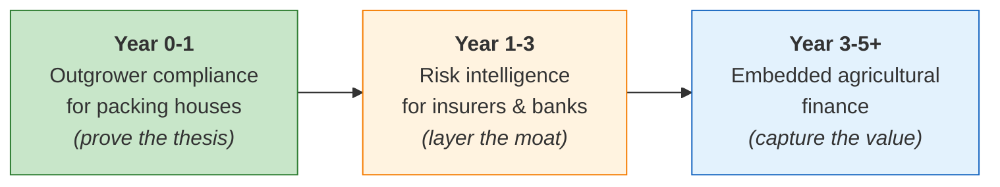
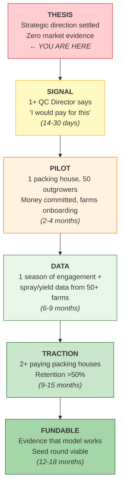

# IrrigAgent — Definitive Strategic Analysis

> **Status**: Final. Four rounds of analysis and expert challenge incorporated.
> **Date**: July 2026
> **Purpose**: The single reference document for strategic direction, execution priorities, and the first enterprise conversations.
> **Audience**: Founders, advisors, future investors.

---

## Part 1 — The Settled Thesis

Four rounds of analysis, correction, and challenge have converged on a strategic direction. The conceptual debate is over. What remains is empirical: will the market confirm it?

### What We Know

| Conclusion | Confidence | Status |
|---|---|---|
| Direct B2C monetization of smallholders is structurally broken | ✅ High | Settled |
| The farmer engagement layer is necessary infrastructure, not a mistake — it is the data collection engine | ✅ High | Settled |
| The company with venture-scale potential is a ground-truth agricultural intelligence company, not a farmer productivity tool | ✅ High | Settled |
| Decision infrastructure (APIs, compliance records, risk scores) is categorically more valuable than dashboards | ✅ High | Settled |
| Geographic density in specific corridors creates a defensible data moat; breadth without density is noise | ✅ High | Settled |
| The CAC inversion (enterprises pay you to onboard outgrower farms) is the key economic unlock | ⚠️ High conviction, zero evidence | Hypothesis |
| Packing house outgrower networks are the precise enterprise target | ⚠️ High conviction, zero evidence | Hypothesis |
| GlobalG.A.P. / MRL / ONSSA compliance is the acute pain point | ⚠️ High conviction, zero evidence | Hypothesis |
| Outgrower farmers will log spray applications honestly via WhatsApp | ⚠️ Medium conviction, zero evidence | Hypothesis |
| Farmer engagement sustains across multiple seasons | ⚠️ Medium conviction, zero evidence | Hypothesis |

### The Company Narrative

**For investors:**
> "We are building the ground-truth data infrastructure for emerging-market export agriculture. Our free WhatsApp service in Darija gives outgrower farmers daily irrigation advice and crop disease triage — and captures every spray application, water event, and harvest date in a digital compliance record. We sell that record to the packing houses who need it to protect their GlobalG.A.P. certification, avoid MRL-triggered shipment rejections, and maintain EU market access. Every enterprise contract simultaneously generates revenue and onboards 100–500 new farms onto our data platform — inverting customer acquisition cost to near zero."

**For packing houses:**
> "We automate GlobalG.A.P. and ONSSA compliance logging for your outgrower network over WhatsApp in Darija — eliminating shipment rejection risks, closing treatment record gaps before your auditor arrives, and giving you harvest forecasts before picking."

**Completing the sentence:**
> **"We are not building a WhatsApp farming assistant. We are building the compliance and intelligence infrastructure that makes emerging-market agriculture exportable, insurable, and financeable — starting with the outgrower networks that nobody else can see inside."**

### The Strategic Sequence



**Start as** the SGS of outgrower compliance (revenue + density acquisition).
**Layer in** risk intelligence as the dataset matures (moat + new revenue streams).
**Evolve toward** embedded finance when data and models are proven (margin expansion).

---

## Part 2 — The Five Remaining Execution Risks

The strategic direction is settled. These are the five risks that determine whether execution succeeds or fails. They are ranked by severity, and each includes what a successful resolution looks like versus what failure looks like.

### Risk 1: Spray Logging Honesty 🔴 CRITICAL

**Why it's the make-or-break risk:**
Everything valuable to the packing house — GlobalG.A.P. crop-protection records, MRL risk mitigation, pre-harvest interval (PHI) compliance — hinges on accurate spray application data. This is simultaneously the most valuable data point and the hardest to collect honestly.

**Why farmers will mis-report:**
- They are using products they shouldn't be (banned molecules, expired registrations)
- They are applying at dosages above label rates
- They are spraying closer to harvest than PHI rules allow
- They fear the data will be used against them (contract termination, price penalties)
- They simply forget to log and backfill inaccurately

**Why "I'll calculate your safe harvest window" is necessary but insufficient:**
The PHI calculator framing correctly transforms spray logging from surveillance into a farmer service. But it only works for farmers who *want* to know their safe harvest date. A farmer who knowingly sprayed too late will actively avoid the system that would expose that fact.

**Mitigation layers (none sufficient alone, all necessary):**

| Layer | Mechanism | Limitation |
|---|---|---|
| **Farmer value framing** | PHI calculator, ONSSA product recommendations, dosage guidance | Only works for compliant farmers |
| **Bilateral spray programs** | Packing house pushes recommended spray schedules through the same WhatsApp flow; farmer confirms application | Requires packing house to specify protocols (many already do on paper) |
| **Cross-validation with satellite data** | NDVI anomalies (sudden greenness drops) can flag likely spray events; compare against reported logs | Low resolution — can detect *something happened* but not *what was sprayed* |
| **Social verification** | Aggregate spray patterns across neighboring farms; outlier detection flags farms with suspiciously few reports | Requires density; only works with 50+ farms in a contiguous area |
| **Gradual trust building** | Start with irrigation logging (low sensitivity) → add spray logging after trust is established → add bilateral verification over time | Takes seasons, not weeks |

**What success looks like:** ≥70% of active outgrowers logging ≥80% of spray applications within the first season, with packing house QC directors reporting that the digital records are "useful" even if not perfect.

**What failure looks like:** Farmers game the system — logging only innocuous applications, omitting problematic sprays. Packing house QC directors conclude the data is unreliable and not worth paying for. If this happens, the compliance value proposition collapses and you must pivot the enterprise anchor to a different data product (yield forecasting, irrigation efficiency reporting) where honesty incentives are better aligned.

> [!WARNING]
> **Do not design the spray logging flow in isolation.** Design it only after the first packing house conversations reveal how they currently manage outgrower spray programs and what format/content they actually need. Build what they tell you, not what you assume.

---

### Risk 2: Enterprise Sales Capability 🟠 HIGH

**The gap:** You have demonstrated strong technical and farmer-side product execution. Selling $10–30K annual contracts to Quality Control or Supply Chain Directors at packing houses is a fundamentally different skill set. Discovery calls are the right next step, but converting interest into signed pilots with real money and mandated outgrower onboarding is harder than any analysis can convey.

**What enterprise sales actually requires at this stage:**

| Skill | What It Looks Like | Your Readiness |
|---|---|---|
| Relationship access | Getting a meeting with the right person | ❌ No existing packing house relationships |
| Solution selling | Framing the conversation around their pain, not your product | ⚠️ The one-pager helps, but needs practice |
| Pilot design | Structuring a 3-month engagement with clear success criteria | ⚠️ Needs work |
| Procurement navigation | Handling legal review, data security questions, payment terms | ❌ Untested |
| Objection handling | Responding to "our field agents do this already" or "farmers won't use it" | ⚠️ Needs preparation |

**Mitigation:**

1. **Scope ruthlessly.** You need ONE pilot, not a sales motion. One packing house, 50 outgrowers, 3 months, $5–15K. Everything else is premature.

2. **Use warm introductions.** Cold outreach to QC Directors rarely works. Go through:
   - APEFEL (Association Marocaine des Producteurs et Producteurs-Exportateurs de Fruits et Légumes)
   - Morocco Foodex network
   - Existing cooperative relationships that may connect to packing houses
   - Personal network (agricultural engineering schools, industry events)

3. **Consider a commercial co-founder or advisor.** If no one on the founding team has sold into Moroccan agribusiness, the highest-leverage hire in the next 90 days may not be an engineer — it may be someone who knows 10 QC Directors by first name and can get you into meetings in a week.

4. **The founder must do the first sales personally.** Delegating enterprise discovery to a junior hire or an advisor who "knows people" is a common early-stage mistake. The founder must hear the objections firsthand, because those objections will reshape the product.

---

### Risk 3: Timeline Optimism 🟡 MEDIUM

**The feedback is right:** Booking three quality conversations with actual decision-makers at Souss-Massa packing houses in 10 days is aggressive for a team without existing relationships.

**Realistic timeline adjustment:**

| Action Plan says | Reality more likely | Adjusted target |
|---|---|---|
| Book 3 discovery calls in days 4–10 | Getting the first warm introduction may take 2–3 weeks | 3 substantive conversations within 30 days |
| "If 2 out of 3 jump" as decision point | Treat this as upper-bound, not base case | Even 1 out of 3 expressing genuine interest with specific pain is a strong signal |
| First paid pilot within 90 days | Packing houses have procurement cycles and season planning | First pilot agreement within 4–6 months; actual outgrower onboarding may be seasonal |

**The 14-day plan remains the highest-leverage activity.** The timeline is optimistic, not wrong. Do everything in the plan — just don't treat 14 days as a hard deadline. The real deadline is: have you had at least one substantive conversation with a QC Director before you write another line of code for new features?

---

### Risk 4: Farmer Engagement Decay 🟡 MEDIUM

**The foundational risk that underlies everything:**
Even with packing house endorsement, sustained daily or near-daily interaction via WhatsApp is non-trivial. Novelty fades. The daily irrigation advisory may feel repetitive by month 3. If engagement drops below ~50% after one season, both the data asset and the compliance value proposition collapse.

**Why it might work:**
- The irrigation advisory delivers genuine, daily agronomic value (save water = save money)
- Packing house endorsement or mandate creates external motivation
- The PHI calculator / spray logging adds a new value dimension beyond just irrigation
- Disease triage (CropDoctor) provides intermittent but high-value interactions

**Why it might fail:**
- Daily irrigation prompts become background noise after the first season
- Farmers who irrigate on intuition may not value calculated recommendations
- Spray logging feels like surveillance or paperwork
- Competing WhatsApp groups and messages crowd out the advisory

**Mitigation:**
- **Instrument retention from day one.** Track daily response rates, weekly active users, and monthly active users. If engagement drops below 50% within the first season, this is an existential signal — not a product polish opportunity.
- **Continuously increase value.** Seasonal advisories (frost protection, heatwave response), market price information, peer benchmarking ("your water use is 20% below average for your area"), and input cost savings calculators can sustain engagement.
- **Design for low-friction re-engagement.** A farmer who goes silent for 2 weeks should receive a gentle re-engagement prompt, not radio silence.

---

### Risk 5: Regulatory Acceptance of Digital Records 🟡 MEDIUM

**The assumption the analysis made:** GlobalG.A.P. auditors and ONSSA will accept WhatsApp-derived digital compliance records as valid audit evidence.

**The reality:** GlobalG.A.P. auditors and ONSSA still largely operate on paper or their own prescribed systems. Getting them to accept a third-party WhatsApp-based logging system as valid documentation is a separate, longer battle that involves:
- Engaging with GlobalG.A.P. as an organization about digital record acceptance criteria
- Working with ONSSA on digital certification pathways
- Potentially pursuing GlobalG.A.P. "GLOBALG.A.P. IFA" add-on module certification for your system

**The adjustment:** Early pilots should be positioned as **internal packing-house risk management first**, not formal compliance documentation.

Frame it to the packing house as:
> "This system gives you visibility into your outgrower operations so YOU can catch MRL risks before the crate ships. It reduces YOUR risk regardless of whether the auditor accepts our format. Over time, we work together to get the digital records accepted by auditors — which replaces your paper trail entirely."

This framing:
- Removes the dependency on auditor acceptance from the initial sale
- Still delivers immediate value (risk visibility)
- Creates a pathway to formal compliance acceptance as a future upgrade
- Is honest about what you can deliver today vs. what requires regulatory engagement

---

## Part 3 — The Evidence Ladder

The feedback's most important observation: *"I would not yet write a check solely on the basis of this analysis. The next evidence that matters is real packing-house conversations."*

This section defines exactly what evidence converts each hypothesis from "thesis" to "proof," and what threshold triggers a pivot.

### Evidence Ladder: From Thesis to Fundable Company



### Gate-by-Gate Evidence Requirements

| Gate | Hypothesis | Evidence That Proves It | Evidence That Disproves It | Pivot If Disproved |
|---|---|---|---|---|
| **Gate 4: Will they pay?** | Packing houses will pay for outgrower compliance data | 1+ QC Director commits to a paid pilot ($5K+) with mandated outgrower onboarding | 5+ conversations yield polite interest but zero willingness to pay or pilot | Shift enterprise anchor to MAMDA (insurer) or CAM (bank). If neither bites, reassess whether enterprise data monetization is viable at all. |
| **Gate 3: Density** | Packing house partnerships can deliver farm density | 1 packing house contract onboards 50+ outgrowers who actually engage | Packing house signs but cannot or will not mandate outgrower participation; <20 farms onboard | Test cooperative-led onboarding as alternative density mechanism. If both fail, density hypothesis is broken. |
| **Gate 1: Engagement** | Outgrowers will engage across a full season | ≥60% of onboarded outgrowers still active at month 4 | <40% active at month 4; engagement drops sharply after week 3 | Fundamentally question whether WhatsApp-based data collection works for this population. Consider field-agent-assisted hybrid model. |
| **Gate 2: Data quality** | Spray logging produces usable compliance data | ≥50% of spray applications captured with product name, date, and dosage; QC Director rates data as "useful" | Farmers log <30% of applications, or QC Director says data is unreliable/incomplete for compliance purposes | Pivot data capture to lower-sensitivity data (irrigation, yield) and pursue insurance/bank use cases instead of compliance |

> [!IMPORTANT]
> **Gate 4 (willingness to pay) must be tested FIRST** — it is the cheapest to test and the most consequential. A 30-minute conversation with a QC Director costs nothing. If the enterprise anchor is wrong, you want to know before building spray logging flows, not after.

---

## Part 4 — The Venture-Scale Assessment (Honest Version)

### Is This a Billion-Dollar Company?

**Honest answer: not automatically, but the path exists and is no longer structurally broken.**

| Scale Path | 5-Year ARR | What It Requires |
|---|---|---|
| **Regional compliance SaaS** (Morocco only) | $1–5M | 10–30 paying packing houses in Souss-Massa + Loukkos |
| **MENA compliance + risk intelligence** (Morocco + 2–3 countries) | $5–25M | Playbook replication to Tunisia, Egypt, Senegal. Risk scoring for insurers. |
| **Pan-African agricultural data infrastructure** | $25–100M | 5+ countries, proven risk models, data licensing, institutional customers |
| **Embedded agricultural finance** | $100M+ | Financial licensing, proven underwriting, reinsurance, 5+ years data |

**The bottom line:** The compliance-first strategy can become a meaningful regional business ($1–5M ARR) within 2–3 years with strong execution. Reaching venture-scale ($25M+ ARR) requires geographic expansion, product evolution into risk intelligence, and likely 2–3 rounds of institutional funding. Embedded finance ($100M+) is a 5–10 year aspiration that requires everything else to work first.

**What an investor would need to see before writing a seed check:**
1. At least one paying packing house pilot with mandated outgrower onboarding
2. Evidence of farmer engagement sustaining over one growing season (>50% active at month 4)
3. Some evidence that spray/outcome data is being captured at usable quality
4. A credible plan for Souss-Massa density (path to 500+ farms)
5. A team that can execute both farmer product and enterprise sales (or a plan to fill the gap)

---

## Part 5 — What to Build Now (Final Engineering Priorities)

### Finish the Current v1.0 Sprint

The already-scoped v1.0 engineering work should be completed. It directly supports the instrumentation the strategy requires:

| Item | Strategic Purpose |
|---|---|
| UX polish and production hygiene | Credibility in enterprise conversations ("let me show you what the farmer sees") |
| Outcome feedback buttons (approve/skip/modify) | Foundation for the data capture loop |
| Consent language and data governance | Mandatory before any enterprise pilot or data sharing |

### Then Pause Farmer Features Until Enterprise Conversations Happen

After the v1.0 sprint lands:

| Do NOT Build Yet | Why |
|---|---|
| Spray logging flow | Design it AFTER the first packing house conversations reveal what format and content they need |
| PHI calculator | Same — build what they say, not what you assume |
| Compliance report format | The QC Director will tell you what their auditor accepts |
| Multi-crop expansion | Density before breadth |
| Voice improvements, satellite enhancements, cooperative management tools | Not revenue-driving |

> [!TIP]
> **The sequencing discipline is simple: v1.0 finish → conversations → build only what conversations reveal is needed → pilot.**
>
> Any feature built before conversations is a guess. Educated guesses are still guesses.

---

## Part 6 — Execution Kit

### Appendix A: The 1-Page Exporter Proposition (French)

Print 10 copies. Carry them to every meeting in Souss-Massa.

```
════════════════════════════════════════════════════════════════════════════════
                    IRRIGAGENT — COMPLIANCE DIGITALE OUTGROWERS
          Protégez vos exportations. Éliminez les risques de dépassement LMR.
════════════════════════════════════════════════════════════════════════════════

LE CONSTAT EN SOUSS-MASSA
────────────────────────────────────────────────────────────────────────────────
Chaque saison, des conteneurs d'agrumes et de tomates marocaines sont bloqués
ou refusés dans les ports européens pour dépassement de LMR (Limites Maximales
de Résidus) ou registres de traitement manquants.

La cause principale : la difficulté à suivre précisément ce que vos producteurs
agrégés (outgrowers) pulvérisent, à quel dosage, et le respect des délais
avant récolte (DAR / PHI).

Un seul rejet = 10 000 à 50 000 € de perte directe + alerte RASFF + contrôles
renforcés pendant des mois.

────────────────────────────────────────────────────────────────────────────────
NOTRE SOLUTION : LA TRAÇABILITÉ EN TEMPS RÉEL VIA WHATSAPP (DARIJA)
────────────────────────────────────────────────────────────────────────────────
IrrigAgent fournit à vos producteurs sous contrat un assistant gratuit sur
WhatsApp en Darija pour le calcul quotidien des besoins en eau (méthode FAO-56).

En échange de ce service à forte valeur ajoutée, le système numérise leurs
registres de traitement phytosanitaire :

  ✅  TRAÇABILITÉ PHYTOSANITAIRE AUTOMATISÉE
      Chaque application de produit est enregistrée par le producteur sur
      WhatsApp. Le système calcule automatiquement le Délai Avant Récolte.

  ✅  ALERTES LMR PRÉVENTIVES
      Si un producteur applique un produit hors cahier des charges ou si la
      récolte est planifiée avant la fin du DAR, votre responsable Qualité
      reçoit une alerte immédiate.

  ✅  DOSSIERS PRÊTS POUR L'AUDIT
      Générez les registres d'irrigation et de traitements phytosanitaires
      de 100% de votre réseau d'agrégation avant l'embarquement du conteneur.

────────────────────────────────────────────────────────────────────────────────
PILOTE SOUSS-MASSA — SAISON 2026/2027
────────────────────────────────────────────────────────────────────────────────
  •  Périmètre : 50 producteurs agrégés sur un périmètre de 3 mois
  •  Objectif  : Zéro non-conformité LMR et 100% des registres numérisés
  •  Format    : Pilote payant avec accompagnement dédié

  Contact : [Nom du Fondateur]
  Tél     : [+212 xxx xxx xxx]
  Email   : [email@irrigagent.com]
════════════════════════════════════════════════════════════════════════════════
```

> [!TIP]
> **Pricing is deliberately absent from the one-pager.** Do not anchor a price before you understand the buyer's pain. Let the conversation reveal what they currently spend on compliance (field agents, paper systems, audit preparation) before proposing a number. The discovery script below handles pricing.

---

### Appendix B: Discovery Call Script (French)

Use this structured script with Quality Control Directors or Supply Chain Managers at packing stations.

**Opening & Context** (2 minutes)

> *"Bonjour [Nom], je vous contacte suite aux nouvelles exigences des distributeurs européens concernant GlobalG.A.P. et le contrôle des LMR. Nous développons une solution de suivi des producteurs agrégés en Souss-Massa et nous souhaitons comprendre vos défis actuels de traçabilité au niveau du réseau d'agrégation."*

**Question 1 — Status Quo & Operational Friction**

> *"Comment suivez-vous aujourd'hui les registres de traitement phytosanitaire et l'irrigation chez vos producteurs agrégés sous contrat ?"*

Listen for:
- Paper logbooks collected by field technicians? How often?
- WhatsApp groups for informal communication?
- Any existing digital system? (If yes: do farmers actually use it?)
- How many field agents cover how many outgrowers?

🔴 Red flag: *"All our suppliers use our in-house app daily"* — dig deeper. Apps mandated by packing houses typically have <20% actual usage.

**Question 2 — Quantify the Pain**

> *"Au cours des deux dernières saisons, avez-vous eu des lots bloqués, des alertes LMR ou des non-conformités lors des audits GlobalG.A.P. à cause d'erreurs de traitement chez les agrégés ?"*

Listen for:
- Specific rejection incidents (container value, port, buyer reaction)
- RASFF alerts and their commercial consequences
- Audit stress and preparation costs
- Cost of current compliance monitoring (field agents × visits × months)

✅ Validation signal: A specific story about an outgrower spraying the wrong product or picking too early. This is your core value anchor.

**Question 3 — Test the WhatsApp Mechanism**

> *"Si vos producteurs recevaient un suivi d'irrigation gratuit par WhatsApp en Darija et qu'en contrepartie nous numérisions automatiquement leurs traitements pour votre responsable qualité, pensez-vous qu'ils joueraient le jeu ?"*

Listen for:
- Objections about farmer honesty (*"They'll hide what they spray"*)
- Objections about tech literacy (*"They don't type"*)
- Objections about farmer resistance (*"They'll see it as surveillance"*)

Counter for honesty: *"The system calculates the safe harvest window FOR the farmer — skipping the log means losing the advisory."*

Counter for literacy: *"The system works with Darija voice notes and simple button replies. No typing required."*

Counter for resistance: *"The farmer gets free irrigation advice and disease diagnosis. The compliance log is a natural side effect, not the primary interaction."*

**Question 4 — Commercial Pricing Gate**

> *"Si ce système éliminait vos risques de rejet LMR et préparait 100% de vos dossiers d'audit GlobalG.A.P. pour votre réseau, quel budget annuel serait envisageable pour vous ?"*

- Do NOT anchor a price. Let them name a range first.
- If they push back: *"Combien vous coûte aujourd'hui le suivi terrain de vos agrégés ? Entre les techniciens, les cahiers, et la préparation d'audit ?"*
- If they name a number: validate against the rejection cost. *"Et le coût d'un seul conteneur refusé ?"*

**Closing** (2 minutes)

> *"Merci pour votre temps. Si les résultats de nos échanges confirment un intérêt, nous proposerions un pilote de 3 mois sur 50 producteurs de votre réseau, avec un accompagnement dédié. Est-ce que ce format vous semblerait pertinent ?"*

---

### Appendix C: Minimum Viable Compliance Data Model

> [!WARNING]
> **This schema is a starting point for internal planning, not a build-now directive.** The actual data model should be designed after the first packing house conversations reveal what fields, formats, and audit standards they need. Build what they tell you, not what you assume.

**Entity Relationships:**

```
                  ┌──────────────────────────┐
                  │      PackingHouse        │
                  │ (exporter_id, ONSSA_no,  │
                  │  globalg_ap_number)      │
                  └───────────┬──────────────┘
                              │ 1:N
                  ┌───────────▼──────────────┐
                  │       Outgrower          │
                  │ (farmer_id, GPS parcel,  │
                  │  crop, ha, consent_date) │
                  └───────────┬──────────────┘
                              │
          ┌───────────────────┼───────────────────┐
          │ 1:N               │ 1:N               │ 1:N
┌─────────▼───────────┐ ┌────▼──────────────┐ ┌──▼───────────────┐
│  SprayApplication   │ │ IrrigationEvent   │ │  HarvestRecord   │
│                     │ │                   │ │                  │
│ • product_name      │ │ • date/time       │ │ • date           │
│ • active_ingredient │ │ • duration_min    │ │ • estimated_yield │
│ • ONSSA_approval_no │ │ • method          │ │ • quality_grade   │
│ • dosage (L/ha)     │ │ • source (rain/   │ │ • destination     │
│ • target_pest       │ │   drip/flood)     │ │   (packing house) │
│ • application_date  │ │ • ET₀ reference   │ │ • logged_via      │
│ • PHI_days          │ │ • decision        │ └──────────────────┘
│ • safe_harvest_date │ │   (accept/skip/   │
│ • compliance_status │ │    modify)        │
│ • logged_via        │ │ • logged_via      │
│   (text/voice/photo)│ └───────────────────┘
└─────────────────────┘
```

**Compliance status values:**
- `COMPLIANT` — Product is ONSSA-registered for this crop, dosage within label, PHI will be respected
- `PHI_VIOLATION` — Harvest planned before pre-harvest interval expires
- `DOSAGE_WARNING` — Applied dosage exceeds label recommendation
- `UNREGISTERED_PRODUCT` — Product not found in ONSSA registry for this crop
- `PENDING_VERIFICATION` — Logged but not yet validated

---

## Part 7 — Final Assessment

### What Is Settled

The strategic direction — free WhatsApp engagement layer → ground-truth data from outgrower networks → enterprise compliance and risk products for packing houses, insurers, and banks — is coherent, grounded in the actual structure of Moroccan export agriculture, and represents the only viable path to venture-scale outcomes from the current asset base.

### What Is Not Settled

The five execution risks are real and unresolved. The biggest remaining uncertainties are empirical, not conceptual:

1. Will packing houses pay for outgrower compliance data?
2. Will outgrowers report sprays honestly and keep engaging?
3. Can you reach density through packing house partnerships?
4. Can you execute enterprise sales with your current team?
5. Will GlobalG.A.P. auditors eventually accept digital records?

### What Happens Next

These questions are answerable in the next 60–90 days through conversations and one tightly scoped pilot. Until they are answered, this remains a **strong thesis with a working technical foundation** — not yet a de-risked company.

### Confidence Assessment

| Dimension | Confidence | Rationale |
|---|---|---|
| **Strategic direction** | **76%** | Four rounds of challenge have converged. The thesis is coherent and grounded. |
| **First enterprise customer type** (packing houses) | **65%** | Strongest candidate by sales complexity, product fit, and pain acuity — but zero market evidence yet |
| **Execution within stated timelines** | **55%** | Timelines are optimistic for a team without enterprise relationships |
| **Venture-scale outcome (5-10 yr)** | **45%** | Possible path exists but requires geographic expansion, multi-year data moat, and significant funding |

### The Final Word

> **The strategic analysis is done. The next artifact that matters is a meeting note from a packing house in Agadir.**
>
> Finish the v1.0 sprint. Print the one-pager. Book the conversations. Everything else is preparation for the only test that matters: does a Quality Control Director in Souss-Massa look at this and say *"Where do I sign?"*
>
> If yes — build what they asked for, onboard their outgrowers, and you have a company.
>
> If no — you have learned something invaluable in 30 days that would have taken 12 months of feature development to discover. Pivot the enterprise anchor, test the next buyer, and iterate.
>
> Either way, you win. But only if you start the conversation.
